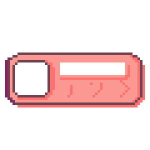

# 🎵 Pixel MP3 Player

A retro-style pixel art MP3 player built with HTML, CSS, and JavaScript. Features authentic pixel art design, dynamic album covers, and smooth animations.



## ✨ Features

- **🎨 Pixel Art Design**: Authentic retro aesthetic with pixelated graphics
- **🖼️ Dynamic Album Covers**: 15×15 pixel art album covers that change per song
- **📜 Smart Text Display**: Text scrolls only when playing, stays static when paused
- **🎮 Smooth Controls**: Subtle button animations with hover effects
- **🔀 Playlist Support**: Easy navigation between songs
- **📱 Responsive Layout**: Clean, centered design

## 🚀 How to Use

### Basic Controls
1. **Play/Pause**: Click the center button to start/stop music
2. **Next Song**: Click the right arrow button
3. **Previous Song**: Click the left arrow button

### Text Behavior
- **When Playing**: Song title and artist scroll continuously with ▶ icon
- **When Paused**: Text stays static with ❚❚ icon, aligned to the left

## 📁 Project Structure

```
Mini-MP3-Player/
├── index.html              # Main HTML file
├── style.css               # Stylesheet with pixel art styling
├── script.js               # JavaScript functionality
├── songs.json              # Song playlist configuration
├── convert_covers.sh       # Batch album cover conversion script
├── assets/
│   ├── mp3-components/     # UI components (buttons, background, etc.)
│   ├── pixel-cover/        # Pixelated album covers (60×60px display)
│   └── original-cover/     # Original album cover images
└── audio/                  # MP3 audio files
```

## 🎵 How to Add New Songs

### Step 1: Add Audio Files
1. Place your MP3 files in the `audio/` folder
2. Use clear, descriptive filenames

### Step 2: Add Original Album Covers
1. Place high-quality album cover images in `assets/original-cover/`
2. Supported formats: JPG, PNG
3. Any size works (script will resize automatically)

### Step 3: Convert Album Covers to Pixel Art
Run the conversion script to create pixelated versions:

```bash
./convert_covers.sh
```

This script will:
- Convert all images from `assets/original-cover/`
- Create 15×15 pixel art versions scaled to 60×60px
- Save them in `assets/pixel-cover/` with `_pixel.png` suffix

### Step 4: Update songs.json
Add your song entry to the `songs.json` file:

```json
{
  "title": "Your Song Title",
  "artist": "Artist Name", 
  "cover": "assets/pixel-cover/your_cover_pixel.png",
  "file": "audio/your-song.mp3"
}
```

### Example songs.json Entry
```json
{
  "title": "LOCK YOUR GAZE",
  "artist": "MODE/D",
  "cover": "assets/pixel-cover/lockyourgaze.png",
  "file": "audio/LOCK YOUR GAZE.mp3"
}
```

## 🛠️ Technical Details

### Album Cover Specifications
- **Original**: Any size (placed in `original-cover/`)
- **Processed**: 15×15 true pixels, displayed at 60×60px
- **Format**: PNG (for transparency support)
- **Style**: Pixelated using nearest-neighbor filtering

### Font
- **Primary**: Bytesized (Google Fonts)
- **Fallback**: Monospace
- **Style**: Pixel-perfect rendering with crisp edges

### Browser Compatibility
- Modern browsers with ES6 support
- Chrome, Firefox, Safari, Edge
- Mobile browsers supported

## 🎨 Customization

### Changing Colors
Edit the CSS color values in `style.css`:
- Text color: `.title-box #song-info { color: #6e4250; }`
- Background: `body { background-color: #fdf6e3; }`

### Adjusting Layout
Modify positioning in `style.css`:
- Album position: `.album { top: 122px; left: 28px; }`
- Text position: `.title-box #song-info { top: 128px; left: 123px; }`

### Button Styling
Button images are located in `assets/mp3-components/`:
- `button_play_pause_trimmed.png`
- `button_previous_trimmed.png`
- `button_next_trimmed.png`

## 🔧 Development

### Running Locally
1. Clone or download the project
2. Open `index.html` in a web browser
3. Or use a local server for best results:
   ```bash
   python -m http.server 8000
   # or
   npx serve .
   ```

### Adding Features
- Edit `script.js` for functionality changes
- Modify `style.css` for visual updates
- Update `index.html` for structure changes

## 📝 Notes

- Ensure audio files are in supported formats (MP3 recommended)
- Keep filenames simple (avoid special characters)
- Album covers work best when square (1:1 aspect ratio)
- The conversion script requires ImageMagick (`brew install imagemagick`)

## 🎯 Tips

- **Performance**: Use compressed MP3 files for faster loading
- **Quality**: Higher resolution original covers = better pixel art results
- **Organization**: Use consistent naming conventions for easy management
- **Testing**: Test in multiple browsers to ensure compatibility

## 🐛 Troubleshooting

**Album cover not showing?**
- Check file path in `songs.json`
- Ensure pixel cover exists in `assets/pixel-cover/`
- Run conversion script if needed

**Audio not playing?**
- Verify MP3 file exists in `audio/` folder
- Check browser console for errors
- Ensure file path is correct in `songs.json`

**Text not displaying correctly?**
- Check font loading (Bytesized from Google Fonts)
- Verify text positioning in CSS
- Check for JavaScript errors in console

---

## 🎮 Enjoy your retro pixel music experience! 🎵